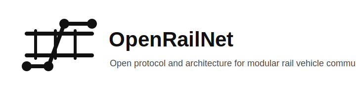

  

# OpenRailNet (ORN)

OpenRailNet (ORN) is an open protocol and system architecture for communication between modular rail vehicles.

It is designed to enable:
- automatic train composition discovery
- multi-locomotive coordination
- distributed control of vehicle subsystems
- scalable and interoperable hardware implementations

OpenRailNet is not just a protocol. It is a complete **open ecosystem** consisting of:
- a communication protocol
- a system architecture
- a hardware interface model
- reference implementations (firmware + hardware)

---

## 🚧 Status Overview

OpenRailNet is currently in an **early-stage design and prototyping phase**.

Current snapshot:

- Protocol documentation exists and the packet/header definitions are being aligned
- The portable protocol layer currently defines the wire format in headers, but is not yet a complete implementation library
- Firmware bring-up has started with an RP2040 PlatformIO target, but it is still a board/prototype stub rather than a full network node
- Hardware architecture is documented, but reference hardware implementations are still planned

What that means in practice:

- the architecture direction is defined
- the protocol is still evolving
- breaking changes are expected
- the first real milestone is a working multi-node prototype

---

## 🧠 What this project is

OpenRailNet defines **how rail vehicles communicate with each other**.

Each vehicle (locomotive, wagon, etc.) contains a node that:
- connects to neighboring vehicles via two links (Port A and Port B)
- participates in a train-wide network
- exposes local functionality (e.g. traction, lights, sensors)

The system allows vehicles to:
- detect neighbors automatically
- determine their position in the train (consist)
- coordinate behavior across the entire train

---

## 🎯 Goals

- Open and extensible protocol
- Hardware-agnostic communication layer
- Deterministic and debuggable behavior
- Simple implementation on embedded systems (RP2040, ESP32, etc.)
- Support for real-time control (e.g. traction)
- Automatic topology discovery (no manual configuration)

---

## 📦 Scope

This repository includes:

### 1. Protocol Definition
- Packet structure
- Addressing
- Discovery and topology management
- Keepalive and fault detection
- Control and status messaging

### 2. System Architecture
- Node roles (loco, wagon, gateway)
- Network topology (A/B link chain)
- Consist management
- State machines

### 3. Hardware Architecture
- General node layout (Port A / Port B / Local interface)
- Link interface definitions (e.g. RS-485 full duplex)
- Power and signal considerations
- Coupler signal concepts

### 4. Reference Implementations (work in progress)
- Portable protocol library (C)
- PlatformIO firmware targets (RP2040, ESP32)
- Hardware designs (schematics, PCB, BOM)

---

## 🏗️ Project Structure

    openrailnet/
    ├─ docs/          → Human-readable specification
    ├─ protocol/      → Portable reference implementation (C)
    ├─ hardware/      → Hardware architecture + implementations
    ├─ firmware/      → Platform-specific implementations (PlatformIO)
    ├─ tools/         → Debugging and simulation tools
    ├─ examples/      → Minimal examples and walkthroughs

---

## 🤝 Philosophy

OpenRailNet is designed to follow a small set of strong principles:

### Open
No proprietary dependencies. The protocol and architecture are fully transparent.

### Simple
Must be implementable on low-cost microcontrollers without complex infrastructure.

### Deterministic
System behavior should always be predictable and debuggable.

### Transparent
All communication is explicit and inspectable — no hidden state or implicit behavior.

### Modular
Each vehicle is an independent node that can be combined into arbitrary train configurations.

### Extensible
New features and capabilities can be added without breaking existing systems.

---

## 📚 Documentation

Start here:

- docs/protocol/overview.md → Protocol fundamentals
- docs/architecture/system-overview.md → System structure and topology
- docs/hardware/overview.md → Hardware architecture and node layout

The documentation is structured to be readable by both:
- humans (engineers, builders)
- machines (LLMs, tooling)

---

## 🔧 Future Work

Planned next steps:

- Complete formal protocol specification
- Stabilize packet definitions and discovery flow
- Build first multi-node working prototype
- Develop reference hardware designs
- Implement simulation and debugging tools
- Define compatibility/versioning strategy

---

## 📄 License

TBD (likely MIT or Apache-2.0)
